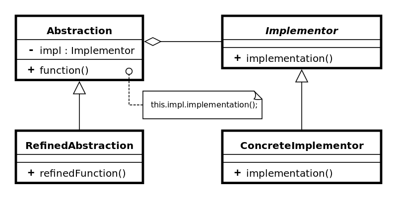

Bridge design pattern
=====================

### Definition

Bridge design pattern decouples an abstraction from its implementation
so that these two can vary independently.

### Details

Heaving some defined abstraction (rather abstract class than interface)
and some implementor (interface) which is being used by our
abstraction, we can separate concrete abstraction from a specific 
implementation of implementor.

Bridge can be used when we are willing to have a (set of) concrete
implementation(s) of abstraction using some interface(s) for which
different implementation may exists as well.

It's similar to Strategy pattern though Strategy is behavioral
pattern and Bridge is Structural. While Strategy is used to 
switch between separate implementations (e.g of algorithm) within some
context (abstraction), Bridge allows to change interfaces
and abstractions independently.

### Example implementation

Imagine we are designing service gathering builds data from deployment
service (e.g. Jenkins, QuickBuild). Our abstraction is `Build` class
where concrete class represents specific builds types. Implementor
is `Source` which is inherited by specific source.
