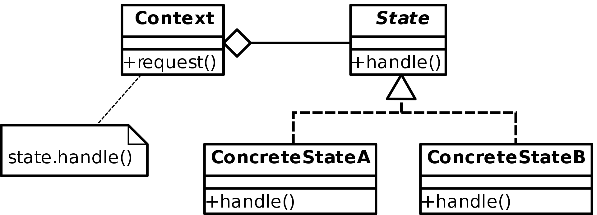

State design pattern
====================

### Definition

Allows an object to alter its behaviours when its internal state changes.
The object will appear to change class.

Pattern type - Behavioral

### Details

Context is the thing that can have state.  
State represents an interface as we want to define family of states.  

State objects are not expected to be operated directly as they represents state
of Context (that's why in definition it says `Allows an object to alter its
behaviours when its internal state changes`).

By calling Context `request()` method we affect state so it delegates
this request to State object.

In this pattern a set of different if-else clauses is replaced by polymorphism.

### Example implementation

In a given example `IGateState` interface is defined. States like `OpenGateState`,
`ClosedGateState`, `ProcessingGateState` implement `IGateState` interface.
By performing methods on `Gate` object like `pay()`, 'payOk()', `payFailed()` or
`enter()` gate's internal state alters.

It's the gate state object which is responsible for states transfer implementing logic.
