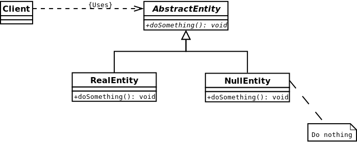

Null Object design pattern
==========================

### Definition

Encapsulate the absence of an object by providing a substitutable
alternative that offers suitable default do nothing behavior.

Pattern type - Behavioral

### Details

Null design pattern implements do-nothing-behaviour for defined interface.

Since nulls determinate conditions and branches, which potentially may cause a lot
of problems, Null design pattern provides solutions for treating non-values
uniformly.

### Example implementation

Sentinel node in linked list is great example of null design pattern implementation.
