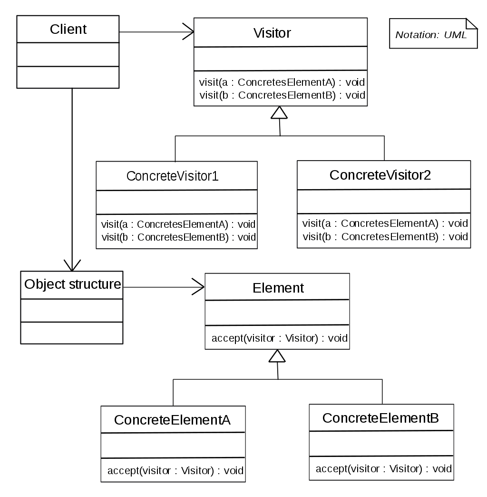

Visitor design pattern
======================

### Definition

Allows to separate an algorithm from an object structure on which it operates.
A practical result of this separation is the ability to add new operations to existing object structures without modifying the structures.

Pattern type - Behavioral

### Details

Visitor defines an interface which being implemented by subclasses allows
to extend existing client's interface without modifying its code.

It allows to add methods to classes of different types without much
altering to those classes. Usage of different methods depending on used
classes may be performed.

Allows to define external classes that can extend other class without majorly editing them.

### Example implementation

`ICreditCard` defines an interface for `GoldCreditCard`, `SilverCreditCard` and `BronzeCreditCard`.
`IVisitor` defines an interface for `GasDiscountVisitor`, `FoodOfferVisitor` and
`HotelOfferVisitor`.
`ICreditCard` defines `accept(IVisitor v)` method which takes `IVisitor`
type argument and perform actions from `IVisitor` interface defined for 
specific implementation of `ICreditCard`. 
