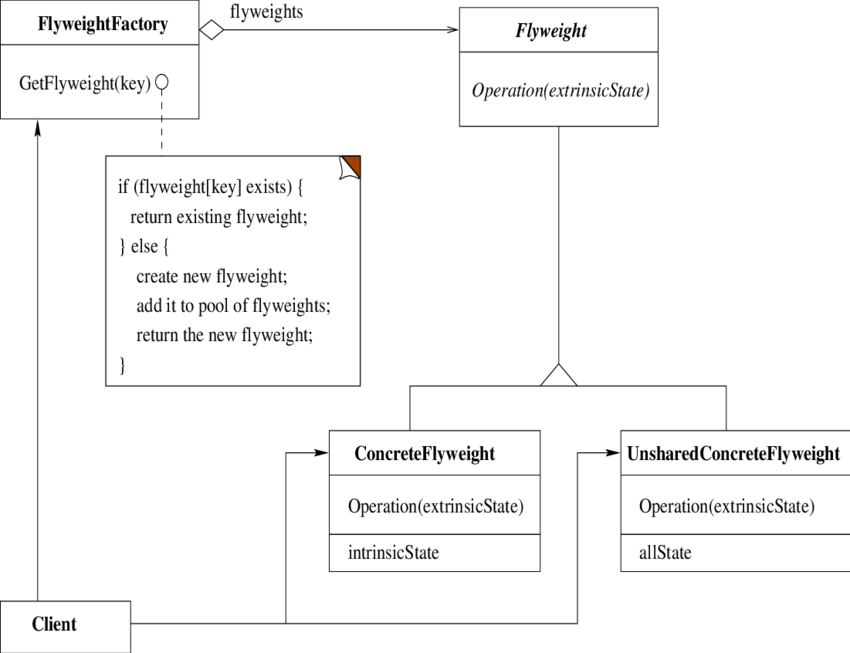

Flyweight design pattern
========================

### Definition

Provides ways to decrease object count thus improving application required objects structure.
Flyweight pattern is used when we need to create a large number of similar objects.

Structural design pattern.

### Details

- This pattern is useful when a very large number of instances of a class must be created.
- It allows to create huge number of virtual objects without need to explicitly instantiate
every single one.
- Reduces memory footprint and speedups code execution
- simplifies code
- Useful when there are high costs of object storing
- ... and objects does not have to be unique
- works nicely with factory, visitor and null object pattern

Important note is that flyweight is dedicated to object which are immutable.

#### Intrinsic and Extrinsic states

Each "flyweight" object is divided into two pieces: the state-dependent (extrinsic) part,
and the state-independent (intrinsic) part.

Intrinsic state is stored (shared) in the Flyweight object.

Extrinsic state is stored or computed by client objects, and passed to the Flyweight when its operations are invoked.

### Example implementation

`Free list` is a mechanism used in garbage collecting in some programming languages (Ruby).
Idea is that interpreter (process) pre-allocates some memory for objects to have ability to
instantiate/create new ones quickly. 

In a given example new objects of `IListObject` type are created within `FreeList`.
During initialization, given amount of not used `IListObject` are created and cached.
By calling method `getNew()` of `FreeList` object, reference count of `IListObject` is increased
and point to created object is returned.
If object is removed (by calling `deleteObject()` method) it's reference count is set to 0.
In fact object is not destroyed at all, but can be reused by `FreeList` if, however,
there are no free (reusable) object in free list, allocation exception is raised.

Other example might be how number from range -5...256 are "pre cached" in Python's
interpreter.