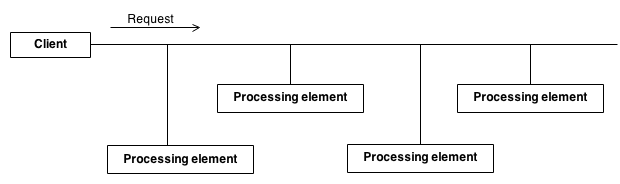

Chain of responsibility design pattern
======================================

### Definition

Chain of responsibility lets you pass requests along a chain of handlers. Upon receiving a request, each handler decides either to process
the request or to pass it to the next handler in the chain.

### Details

Pattern allows to process data in a chain by performing specific operations
in a given order. Client requests data processing within handler.
Handler provides an interface of at least two methods:
- execute(request)
- sexNextChain(next_chain_element)

It creates a list of processing elements. After performing processing (or not, according to implemented logic),
request may be passed to another processing unit within chain.  




It can be treated as a object oriented version of if...else if...else if...end idiom.

### Example implementation

Logger can be implemented using this pattern. Within this example, an `ILogger` interface
has been implemented with methods:
- sexNextLogger
- logMessage
- write
- destructor

`ConsoleLogger` and `ErrorLogger` are examples of logger implementing `ILogger` interface.
By calling `Logger::getLogger()` static method, chain of loggers is created.

With code:
```c++
ILogger *logger = Logger::getLogger();
logger->logMessage("Some debug message", logger->DEBUG);
logger->logMessage("Some error message", logger->ERROR);

delete logger;
```

such output is obtained:
```
Console: Some debug message
Console: Some error message
[ERROR]: Some error message
Deleting logger of level0
Deleting logger of level40

```

Brief description and inspiration for example can be found
[here](https://www.tutorialspoint.com/design_pattern/chain_of_responsibility_pattern.htm).