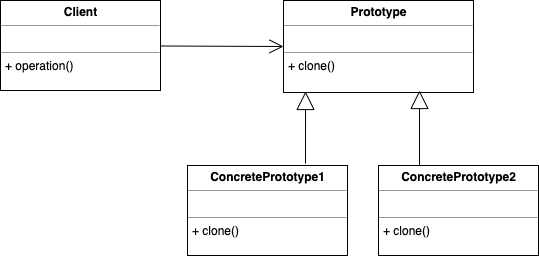

Prototype design pattern
========================

### Definition

Allows to copy existing objects without making code dependencies on their classes.

Pattern type: creational

### Details

Prototype delegates the cloning process to the actual objects that are being cloned.

### Example implementation

Class `Clonable` defines an interface for clone method.  
Class `Client` defines abstract class for general clients and it implements `Clonable` interface.  
`ClientA` and `ClientB` are classes inheriting  from `Client` thus implementing `Clonable`.

Clone of each client object can be created by calling `clone()` method of each client.

In UML diagram `Prototype` is what `Clonable` represents in my code. 
