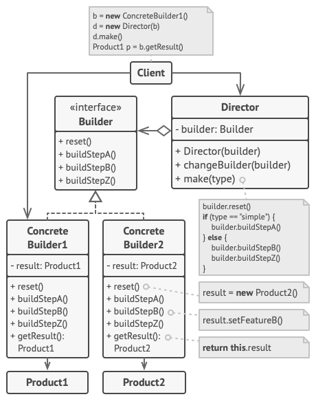

Builder design pattern
======================

### Definition

Builder lets construct objects step by step. It allows to build different types and
representations of an object using the same construction code.

Pattern type - Creational

### Details

Builder interface provides steps which can be executed during creation of an object.  
Builder concrete implementations allows to specify what is expected to be done
in each step. Builder acts as a **specification**, while responsibility of creating
concrete object is delegated to Director (may be called Engineer as well). 

### Example implementation

`IPizzaBuilder` interface defines steps needed to create delicious pizza.
`CapriciosaRecipe` and `MargharitaRecipe` are examples of `IPizzaBuilder`.
In given example, `Cook` class represents Director, who is responsible for pizza
creation. Think as Builder = Specification aka Recipe, Cook = Director.
