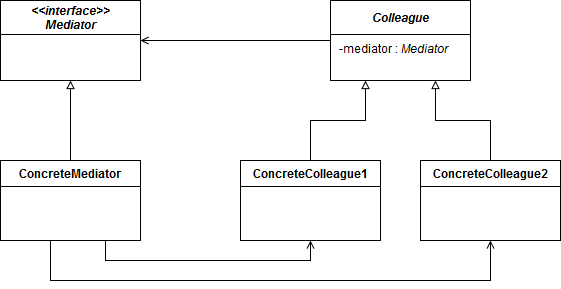

Mediator design pattern
=======================

### Definition

Allows loose coupling by encapsulating the way disparate sets of objects interact
and communicate with each other. Allows for the actions of each object set to vary
independently of one another.

Pattern type - Structural

### Details

Mediator is applicable when several objects (clients/colleagues) are expected to communicate
based on some rules and conditions, however, they are not allows to communicate directly.
Communication of these objects is managed by Mediator.

It's different than Proxy, which is about controlling an access between objects.
In Mediator, communication rules and conditions are implemented in Mediator, client
only sends communication request.

### Example implementation

Stock market exchange may be good example where Mediator pattern may be used.
Clients what to buy/sell stocks whereas mediator is responsible for managing transactions
and performing actual operations between clients.

Video describing such example can be found [here](https://www.youtube.com/watch?v=8DxIpdKd41A).
