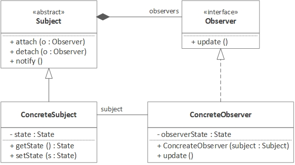

Observer design pattern
=======================

### Definition

The observer pattern defines one to many dependency between objects, so that
when one object changes state all of it's dependencies are notified and updated
automatically. 

Pattern type - Behavioral

### Details

This pattern focuses on `push` architecture instead of pooling. We distinguish observable
(aka subject) and observer object(s).

### Example implementation

Imagine a process which needs to perform some calculations. Due to heaviness of a task,
results cannot be provided instantly and in general it's hard to estimate expected time
of arrival. In such case process performing computations will be regarded
as an observable and it's responsibility is to notify when computing finishes.

Process object - `ComputingProcess`, implements an interface - `IComputingProcess` which provides methods:
* registerObservable(Observer obj)
* removeObservable(Observer obj)
* notify()

`ComputingProcess` takes `computes_count` as an argument in it's constructor
(there's some loop to model computational time).

`ProcessClient` (observer) class implements `IProcessClient` interface which provides method
`update()`. When `ComputingProcess` object finishes computations it'll call `update()`
method (push architecture) on client.
