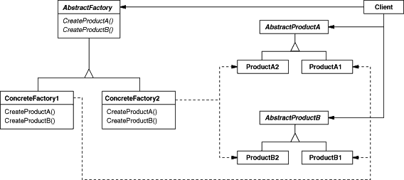

Abstract Factory design pattern
===============================

### Definition

Provides an interface for creating families of related or dependent objects without
specifying their concrete classes.

Pattern type - Creational

### Details

Abstract factory allows to create different objects of a defined interfaces
which are somehow related and can only co-exists in specific configuration.

### Example implementation

Relation between engine and transmission can be a good example. It's popular for
car manufacturers to offer specific engines with specific transmissions.
An interface `IMotorSystem` provides methods `getEngine()`
and `getTransmission()`. `Engine` and `Transmission` define
abstract classes from which particular implementations will inherit.

Heaving 3 motors:
 - small
 - medium
 - big
 
Small one works only with 5 speed manual gearbox, medium with 6 speed manual
while biggest engine is available either with 6 speed manual or 
7 speed automatic.

As it's shown, some objects (engine types and transmission) can only work together
in a specific configuration - you can't create car with small engine and automatic gearbox.
