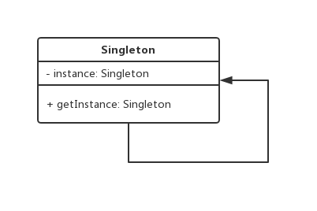

Singleton design pattern
========================

### Definition

The singleton design pattern ensures that class has single instance and provides
a global access to it.

Pattern type - Creational

### Details

This pattern has always caused a lot of fuss and there are countless people calling
it an anti-pattern. In fact it's just another pattern - IT IS hard to find reasonable
application for it but it's doable.

At the implementation level it is important to note that constructor must be private!.

### Example implementation

Config objects potentially COULD be implemented using this pattern to ensure
that whole application (e.g. webapp) use the same settings.

The biggest trick to deal with sigleton in C++ is to operate properly with `static`
keyword.