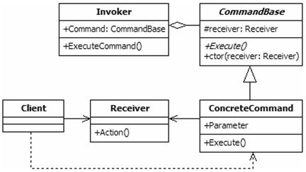

Command design pattern
======================

### Definition

Command pattern encapsulates a request as an object thereby letting you parametrize
other objects with different requests, queue or log requests, and **supports undoable operations**.

Pattern type - Behavioral

### Details

We have a client which sends requests (commands) to some receiver.
We wish to encapsulate (different) requests (aka commands) as an objects implementing 
a common interface for both `do` and `undo` actions.

### Example implementation

Let's stay in the world of cars... we'll model communication between button and
main computer of a car with command pattern. Therefor we'll have interface `iButon`
delivering method `push()`. Each implementation of a button will have associated command which
will implement `iCommand` interface. Button will be an invoker here.
`iCommand` will provide interface with `execute()` (`undo` can be done by receiving
`execute` command second time). Each implementation of `iCommand` needs access to an object on which it performs actions,
in our case - `MainComputer` object - which will be a receiver.

In a nutshell: `Invoker` acts on `Receiver` by sending commands implementing `iCommand`.

In a given example, each command will have dedicated `Invoker` which will be particular button.
However, there is possibility one button could perform several commands (if case would require
such behaviour).

It's worth mentioning that this pattern does not imply invoker to implement specific
interface (though it may as in our case - `iButton`). This pattern is about modelling commands
trough objects implementing unified interface. In this particular case, we could
replace buttons with e.g. `ButtonPanel` which would have several methods
executing dedicated commands.
