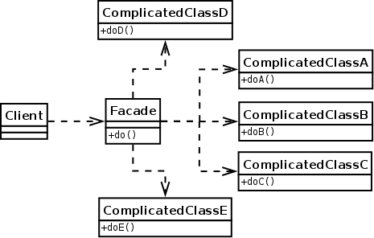

Facade design pattern
=====================

### Definition

The facade provides unified interface to a set of interfaces in a subsystem.
Facade provide a higher level interface that make a sub system easier to use.

Pattern type - Structural

### Details

Facade allows to hide some (complex) logic by aggregating usage of multiple interfaces in a simpler manner.
If client is intended to perform an action which requires usage of multiple
interfaces (objects), then intention of facade is to hide all this logic behind new interface.

It allows not to break the law of demeter.

`Facade does not probide new functionality.`

### Example implementation

We can use Facade if we want to hide several actions behind dedicated method (or 
different actions requiring multiple methods calls). Basically everything
that consists of some smaller pieces put together for something bigger can
be modelled by Facade. Imagine some complex machine (e.g. car) where performing
some operation requires cooperation of multiple other elements.

Assuming that engine launch requires some steps before:
1. setting power to ON
2. checking if engine is ready for run (e.g. there's no fail in system computer)
3. loading some default engine params 
4. launching ignition.

In a given example, `Engine` class provides `lanuch()` method which hides
all required actions for starting engine.
